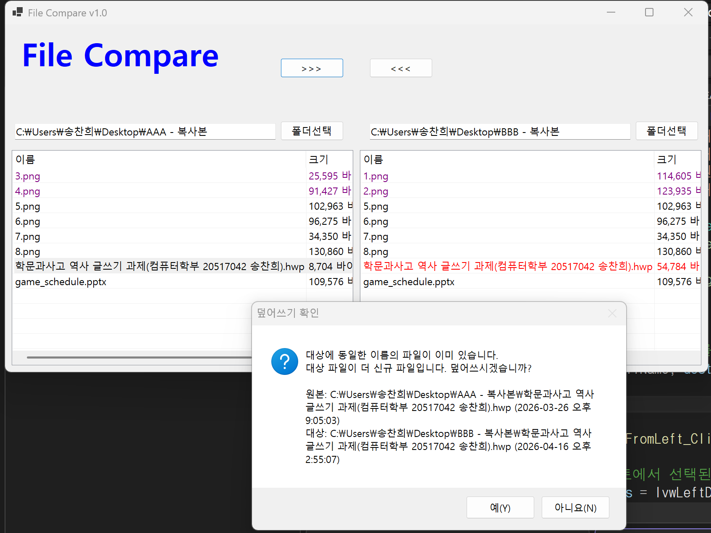
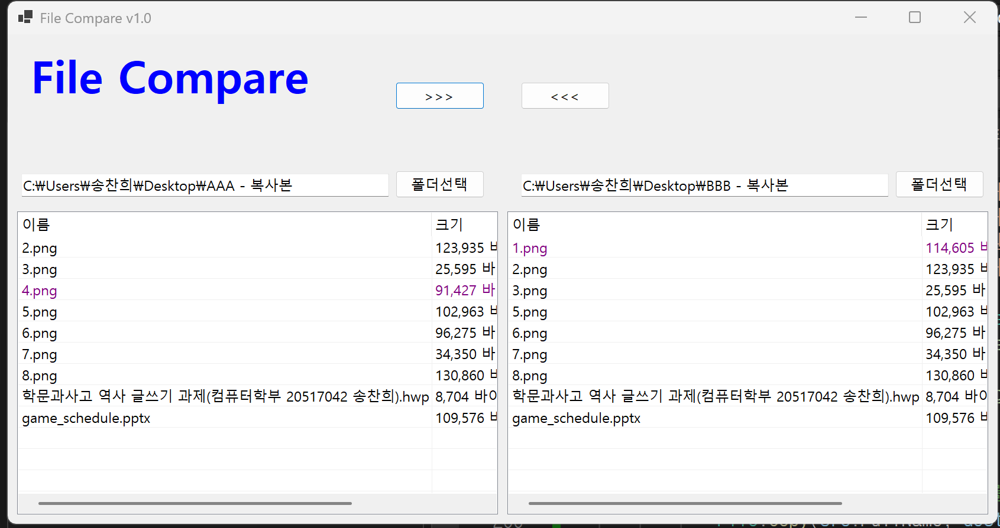
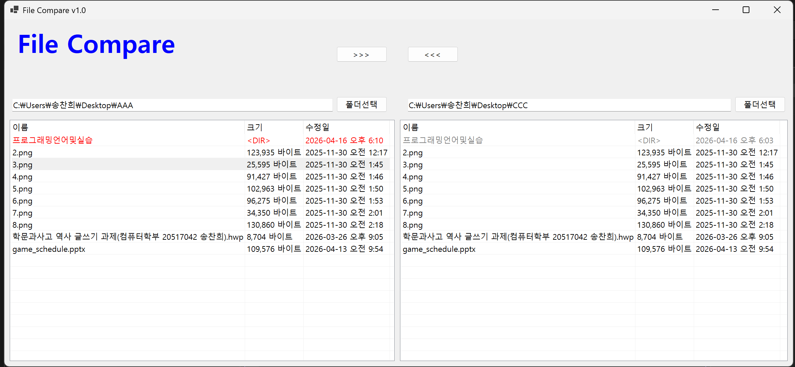
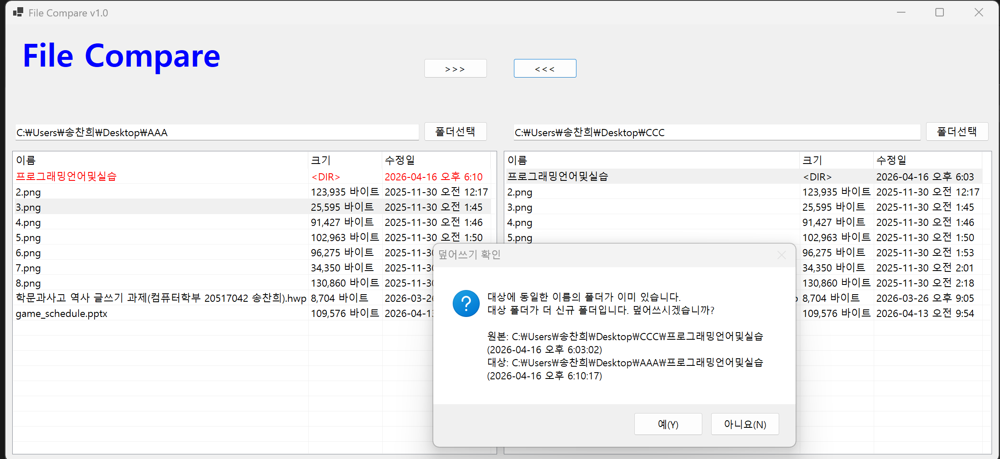
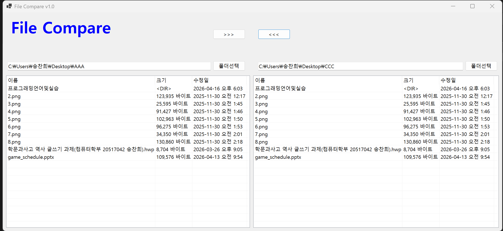

# (C# 코딩) 파일 비교 툴 (File Compare Tool)

## 개요
- C# 프로그래밍 학습
- 1줄 소개: 두 폴더의 파일들을 비교해서 상호 복사하는 툴
- 사용한 플랫폼:
    - C#, .NET Windows Forms, Visual Studio, GitHub
- 사용한 컨트롤:
    - SplitContainer, Panel, ListView, TextBox, Button, FolderBrowserDialog
- 사용한 기술과 구현한 기능:
    - SplitContainer 와 Panel 을 이용한 좌우 대칭형 반응형 UI 디자인 및 레이아웃 구조 설계
    - ListView 컨트롤을 이용한 파일 및 폴더의 상세 정보 출력 인터페이스 구축
    - Directory 및 File 클래스를 이용한 로컬 디렉터리 경로 제어 및 데이터 추출
    - DateTime 클래스를 이용한 수정 시간의 초 단위 정밀 비교 및 최신 상태 판별
    - Dictionary 자료구조와 FileSystemInfo 를 이용한 파일 데이터 매핑 및 상태 대조
    - Color 구조체를 이용한 파일 상태별 4색 글자색 시각화 처리
    - File.Copy 및 Path.Combine 을 이용한 안정적인 양방향 물리적 파일 복사
    - MessageBox 를 이용한 데이터 덮어쓰기 방지 스마트 확인 시스템 구축
    - 재귀 호출(Recursion) 알고리즘을 이용한 하위 디렉터리 구조 및 내부 파일 전체 복사
    - Directory.SetLastWriteTime 을 이용한 복사 후 폴더 수정 시간 강제 동기화

## 실행 화면 (과제 1)
- 코드의 실행 스크린샷과 구현 내용 설명

- 구현한 내용 (위 그림 참조)
    - UI 구성 : SplitContainer 를 사용하여 메인 폼 화면을 좌우 대칭 구조로 균등하게 분할하였으며 각각의 영역 내부에 3개의 Panel 을 수직 계층 구조로 배치하여 상단 앱 제목과 중단 경로 설정 그리고 하단 파일 리스트 출력 공간을 논리적으로 구분하여 구축함
    - 레이아웃 반응형 설정 : 모든 컨트롤에 Dock 및 Anchor 속성을 정교하게 부여하여 사용자가 프로그램 창의 크기를 늘리거나 줄여도 각 요소가 겹치지 않고 정해진 비율에 따라 유연하게 위치와 크기가 재조정되도록 구현함
    - 리스트 뷰 상세 구현 : ListView 의 View 속성을 Details 로 설정하여 파일 탐색기와 같은 표 형태의 인터페이스를 제공하며 파일 이름과 크기 그리고 수정일 등 각각의 데이터 항목을 명확하게 확인할 수 있도록 열 구성을 최적화함
    - 폴더 선택 이벤트 핸들러 : FolderBrowserDialog 클래스를 인스턴스화하여 사용자가 폴더 선택 버튼을 클릭했을 때 표준 폴더 탐색 창이 팝업되도록 하였으며 선택된 디렉터리의 절대 경로를 TextBox 에 즉시 문자열로 전달하는 이벤트 로직을 완성함

## 실행 화면 (과제 2 )
- 코드의 실행 스크린샷과 구현 내용 설명

- 구현한 내용 (위 그림 참조)
    - 파일 비교 로직 : 양쪽 리스트뷰에 로드된 파일들의 이름과 수정 시간을 실시간으로 대조하여 파일 간의 상태 차이를 분석하는 CompareListViews 함수를 구현함
    - 파일 상태 정의 : 비교 결과에 따라 양쪽 폴더의 파일 상태를 동일, New, Old, 단독파일의 네 가지 범주로 분류하여 관리하도록 설계함
    - 색상 구분 출력 : 동일한 파일은 검은색, 상대적으로 최신인 파일은 빨간색, 오래된 파일은 회색, 한쪽 폴더에만 존재하는 단독 파일은 보라색으로 글자 색상을 다르게 표시함
    - 자동 비교 자동화 : 사용자가 좌우 폴더 중 하나만 변경하더라도 PopulateListView 호출 직후 비교 함수가 즉시 실행되어 리스트의 색상 정보가 실시간으로 갱신되도록 처리함
    - 데이터 정밀 대조 : 리스트뷰에 문자열로 표시된 수정 시간 데이터를 DateTime 객체로 파싱하여 초 단위까지 정밀하게 비교함으로써 상태 결정의 정확도를 높임

## 실행 화면 (과제 3)
- 코드의 실행 스크린샷과 구현 내용 설명

- 구현한 내용 (위 그림 참조)
    - 양방향 파일 복사 기능 구현  btnCopyFromLeft 와 btnCopyToLeft 버튼 이벤트를 통해 왼쪽 리스트에서 오른쪽 폴더로 혹은 오른쪽 리스트에서 왼쪽 폴더로 선택된 파일들을 물리적으로 복사하는 기능을 완성함
    - 조건부 덮어쓰기 확인 로직  복사하려는 원본 파일이 대상 폴더에 이미 존재하는 파일보다 수정 시간이 오래된 경우에만 경고 창을 띄워 사용자에게 덮어쓰기 진행 여부를 확인받는 안전 장치를 마련함
    - 상세 정보 기반 알림 창  덮어쓰기 확인 시 원본과 대상 파일의 전체 경로와 마지막 수정 날짜 정보를 메시지 박스에 함께 상세히 출력하여 사용자가 데이터 상태를 정확히 비교하고 판단할 수 있도록 처리함
    - 리스트 및 상태 자동 갱신  파일 복사가 완료된 후 별도의 불필요한 완료 알림 없이 즉시 PopulateListView 와 CompareListViews 를 재호출하여 리스트 목록과 파일 간 비교 색상 상태가 실시간으로 반영되도록 구현함
    - 데이터 관리 및 안정성 확보  Dictionary 저장소를 활용하여 파일 시스템의 정보를 효율적으로 참조하고 Path.Combine 과 File.Copy 를 사용하여 경로 조합 및 파일 복사 프로세스의 안정성을 높임

## 실행 화면 (과제 4)
- 코드의 실행 스크린샷과 구현 내용 설명

- 구현한 내용 (위 그림 참조)
    - 하위 폴더 재귀 복사 기능 구현: CopyDirectory 재귀 함수를 설계하여 폴더 선택 시 하위 디렉토리 구조와 내부 파일 전체를 한 번에 물리적으로 복사하는 기능을 완성함
    - FileSystemInfo 기반 통합 관리: 폴더와 파일을 하나의 단위로 처리할 수 있도록 **FileSystemInfo** 를 도입하여 리스트뷰에서 하위 폴더를 하나의 개체처럼 안정적으로 관리함
    - 디렉토리 수정 날짜 동기화: 복사 시 폴더의 시간이 현재 시각으로 바뀌는 시스템 문제를 해결하기 위해 원본 폴더의 날짜를 대상 폴더에 강제로 동기화하여 색상 일관성을 확보함
    - 폴더 상태 판별 로직 고도화: 하위 폴더에 대해서도 수정 날짜를 기준으로 상태를 대조하여 최신 상태는 **빨간색** , 과거 상태는 **회색** , 일치 시에는 **검은색** 으로 정확히 표시되도록 구현함
    - 재귀 탐색을 통한 구조 유지: 폴더 내부에 깊게 중첩된 여러 단계의 하위 폴더들까지 빠짐없이 탐색하여 원본과 동일한 트리 구조로 대상 폴더에 복제되도록 처리함