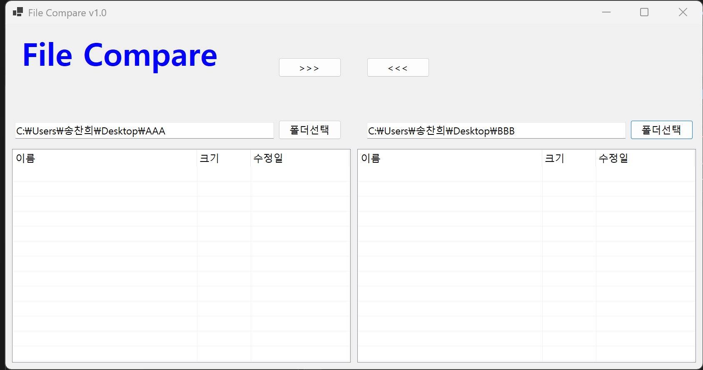
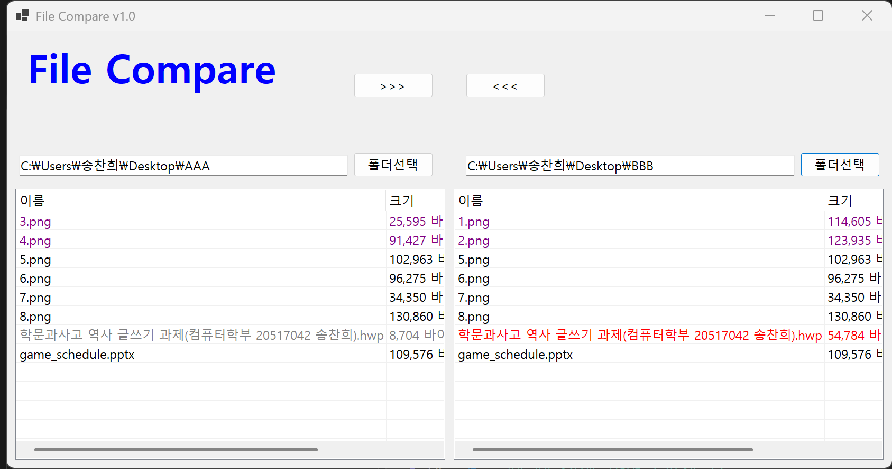

# (C# 코딩) 에코 메신저
## 개요
- C# 프로그래밍 학습
- 1줄 소개: 사용자 키보드 입력을 받아서 처리하는 프로그램
- 사용한 플랫폼: 
- C#, .NET Windows Forms, Visual Studio, GitHub
- 사용한 컨트롤:
- Label, TextBox, ListBox, Button
- 사용한 기술과 구현한 기능:
- Visual Studio를 이용하여 UI 디자인
- string 클래스를 이용한 사용자 입력 데이터 처리
- DateTime 클래스를 이용한 현재시간 정보 구하기

## ## 실행 화면 (과제 1)
- 코드의 실행 스크린샷과 구현 내용 설명

- 구현한 내용 (위 그림 참조)
    - UI 구성 : SplitContainer 를 사용하여 메인 폼 화면을 좌우 대칭 구조로 균등하게 분할하였으며 각각의 영역 내부에 3개의 Panel 을 수직 계층 구조로 배치하여 상단 앱 제목과 중단 경로 설정 그리고 하단 파일 리스트 출력 공간을 논리적으로 구분하여 구축함
    - 레이아웃 반응형 설정 : 모든 컨트롤에 Dock 및 Anchor 속성을 정교하게 부여하여 사용자가 프로그램 창의 크기를 늘리거나 줄여도 각 요소가 겹치지 않고 정해진 비율에 따라 유연하게 위치와 크기가 재조정되도록 구현함
    - 리스트 뷰 상세 구현 : ListView 의 View 속성을 Details 로 설정하여 파일 탐색기와 같은 표 형태의 인터페이스를 제공하며 파일 이름과 크기 그리고 수정일 등 각각의 데이터 항목을 명확하게 확인할 수 있도록 열 구성을 최적화함
    - 폴더 선택 이벤트 핸들러 : FolderBrowserDialog 클래스를 인스턴스화하여 사용자가 폴더 선택 버튼을 클릭했을 때 표준 폴더 탐색 창이 팝업되도록 하였으며 선택된 디렉터리의 절대 경로를 TextBox 에 즉시 문자열로 전달하는 이벤트 로직을 완성함

## ## 실행 화면 (과제 2 )
- 코드의 실행 스크린샷과 구현 내용 설명

- 구현한 내용 (위 그림 참조)
    - 파일 비교 로직 : 양쪽 리스트뷰에 로드된 파일들의 이름과 수정 시간을 실시간으로 대조하여 파일 간의 상태 차이를 분석하는 CompareListViews 함수를 구현함
    - 파일 상태 정의 : 비교 결과에 따라 양쪽 폴더의 파일 상태를 동일, New, Old, 단독파일의 네 가지 범주로 분류하여 관리하도록 설계함
    - 색상 구분 출력 : 동일한 파일은 검은색, 상대적으로 최신인 파일은 빨간색, 오래된 파일은 회색, 한쪽 폴더에만 존재하는 단독 파일은 보라색으로 글자 색상을 다르게 표시함
    - 자동 비교 자동화 : 사용자가 좌우 폴더 중 하나만 변경하더라도 PopulateListView 호출 직후 비교 함수가 즉시 실행되어 리스트의 색상 정보가 실시간으로 갱신되도록 처리함
    - 데이터 정밀 대조 : 리스트뷰에 문자열로 표시된 수정 시간 데이터를 DateTime 객체로 파싱하여 초 단위까지 정밀하게 비교함으로써 상태 결정의 정확도를 높임